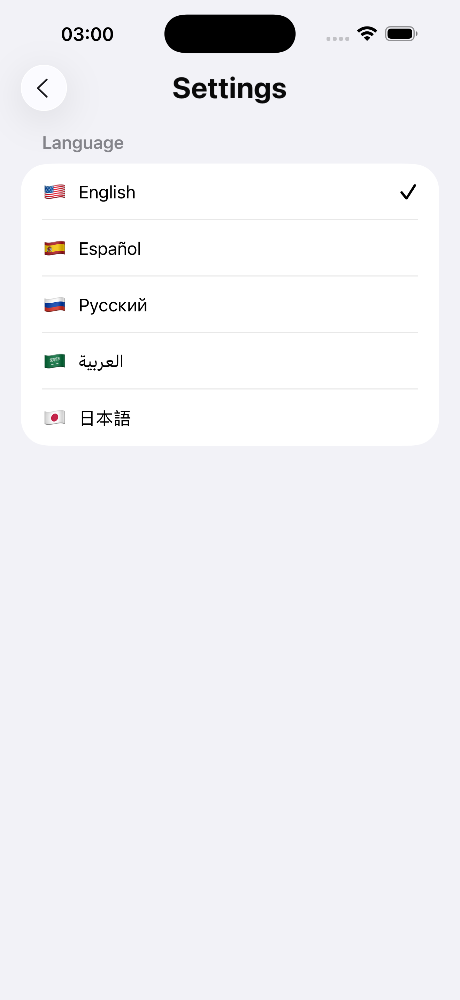
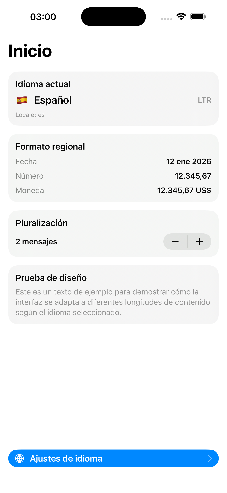
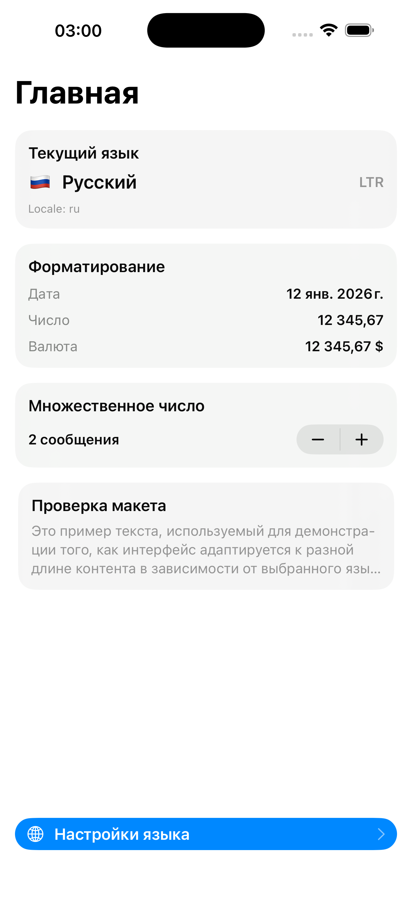
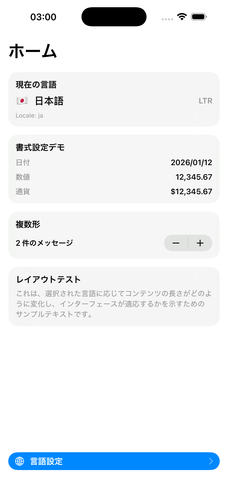
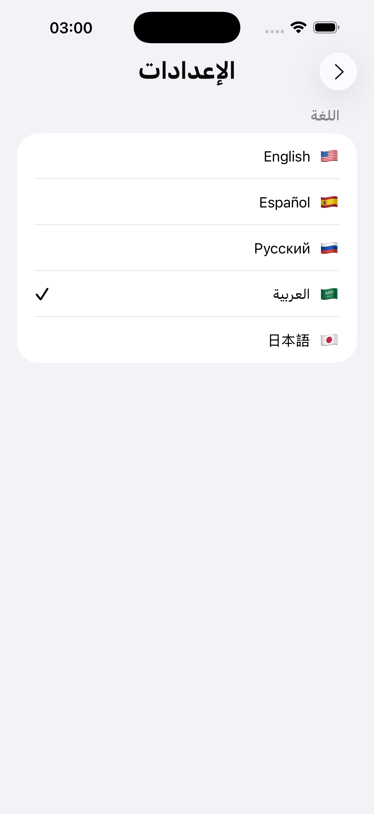

# LocalizationDemo

A SwiftUI demo application showcasing **runtime language switching**, **RTL/LTR layout adaptation**, **pluralization**, and **persistent language storage** using a clean **MVVM architecture**.

This project is designed as a **portfolio-ready example** demonstrating modern iOS localization practices without restarting the app.

---

## ✨ Features

- 🌍 **Runtime language switching** (no app restart)
- ↔️ **Automatic RTL / LTR layout adaptation**
- 🗣️ **Pluralization support** (English, Spanish, Russian, Arabic, Japanese)
- 💾 **Persistent language selection** using UserDefaults
- 🧱 **Clean MVVM architecture**
- ♿️ Accessibility-friendly (VoiceOver & semantic layout)

---

## 🌐 Supported Languages

| Language | Code | Direction |
|--------|------|-----------|
| English | `en` | LTR |
| Spanish | `es` | LTR |
| Russian | `ru` | LTR |
| Arabic | `ar` | RTL |
| Japanese | `ja` | LTR |

---

## 🧠 Architecture Overview

The project follows a **clear MVVM separation**:

```
LocalizationDemo
├── AppEntry
│   └── AppEntry.swift
│
├── Models
│   └── LanguageModel.swift
│
├── ViewModels
│   └── SettingsViewModel.swift
│
├── Views
│   ├── RootView.swift
│   ├── HomeView.swift
│   └── SettingsView.swift
│
├── Storage
│   └── UserDefaultsLanguageStorage.swift
│
├── Extensions
│   └── String+flagEmoji.swift
│
└── Resources
    ├── Assets.xcassets
    └── Localizable.xcstrings
```

### Key Responsibilities

- **LanguageModel**
  - Language metadata (identifier, title, direction, flag)

- **SettingsViewModel**
  - Holds selected language
  - Persists changes via storage abstraction

- **LanguageStorage (protocol)**
  - Abstracts persistence layer

- **UserDefaultsLanguageStorage**
  - Concrete implementation using `UserDefaults`

- **RootView**
  - Injects `locale` and `layoutDirection` into SwiftUI environment

---

## 💾 Persistence Strategy

Language selection is persisted using **UserDefaults**, abstracted behind a protocol:

```swift
protocol LanguageStorage {
    func loadLanguage() -> LanguageModel
    func saveLanguage(_ language: LanguageModel)
}
```

This makes the app:
- Easy to test
- Easy to migrate to another storage (Keychain / File / Cloud)

---

## 🔄 Runtime Localization

The app dynamically updates:
- All visible strings
- Date / number / currency formatting
- Layout direction (RTL / LTR)

Using:
```swift
.environment(\.locale, Locale(identifier: selectedLanguage.identifier))
.environment(\.layoutDirection, selectedLanguage.direction)
```

No app restart required.

---

## 🧩 Pluralization Example

Plural forms are handled using **String Catalog (.xcstrings)**:

```swift
Text("messages_count \(count)")
```

This automatically adapts to language-specific plural rules:
- English: one / other
- Arabic: zero / one / two / few / many
- Russian: one / few / many

---

## 📸 Screenshots

<p align="center">
  
  
  
  
  
  
  
</p>

---

## 🎥 Demo Video

Upload a short screen recording to GitHub and link it here:

```
https://github.com/USERNAME/LocalizationDemo/assets/XXXXX/demo.mp4
```

---

## 🧪 Requirements

- iOS 17.6+
- Xcode 15+
- SwiftUI

---

## 📌 Notes

- The Home screen avoids `navigationTitle` to bypass UIKit caching issues when switching locales at runtime.
- Leading/trailing alignment automatically adapts based on `layoutDirection`.

---

## 📄 License

This project is intended for learning and portfolio demonstration purposes.

